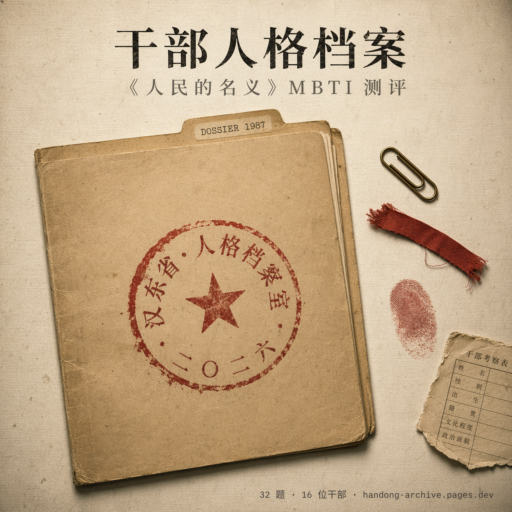
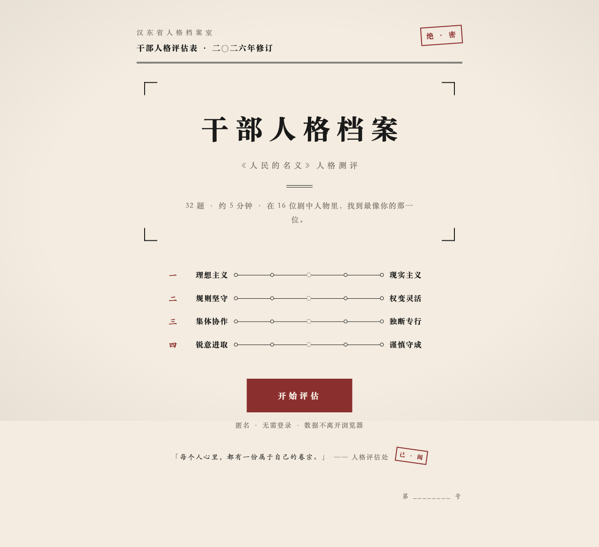
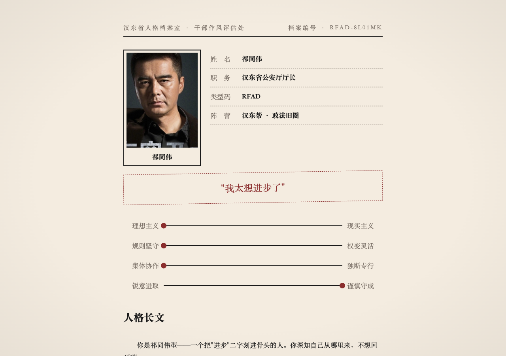
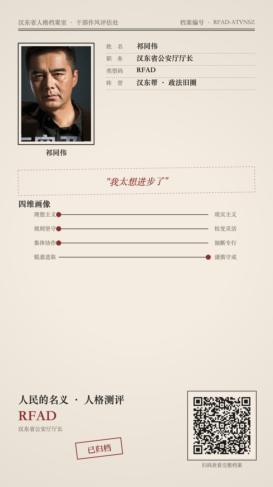

<div align="center">

# 干部人格档案 · 《人民的名义》MBTI 测评

**32 道题 · 4 维人格 · 16 位干部 · 对号入座**

一个把 MBTI 塞进汉东省档案室的粉丝向人格测评站。

[**▶ 立即测一测**](https://handong-archive.pages.dev) ·
[📱 扫码分享](docs/marketing/assets/raw/09_longimage.png) ·
[📣 宣发文案](docs/marketing/)

</div>

---

<p align="center">
  
</p>

<p align="center">
  <sub>实际页面预览 ↓</sub>
</p>

<p align="center">
  
  
</p>

## 怎么玩

1. 花 3 分钟答完 **32 道情景题**
2. 算出你的 **4 维人格坐标**：理想／现实、规则／权变、集体／独断、锐意／谨慎
3. 匹配到最像你的那位剧中角色——沙瑞金、李达康、祁同伟、高育良、孙连城……**16 位全在**
4. 一键生成 **1080×1920 分享长图**，带二维码，发朋友圈扫一下就能看到你的结果

## 看点

- **档案卷宗风** — 朱砂红 × 牛皮纸底色，每份结果都是一页盖了"汉东省人格档案室"钢印的卷宗
- **中文精排** — 用 [`@chenglou/pretext`](https://github.com/chenglou/pretext) 做 CJK 排版，每段逐行展开像印出来的人物侧写
- **链接可复活** — 32 道答案压缩进 URL hash 里，别人点开你的链接看到的结果和你一模一样（不依赖任何后端）
- **零隐私负担** — 没有账号、没有 Cookie、没有埋点、没有数据库；整个站就是一个 `dist/` 静态目录，托在 Cloudflare Pages 的免费额度里

## 16 位干部 · 4 个阵营

| 阵营 | 成员 |
|---|---|
| **沙李派 · 改革阵营** | 沙瑞金 · 李达康 · 侯亮平 · 陈岩石 · 陈海 · 易学习 · 钟小艾 · 季昌明 · 田国富 · 郑西坡 |
| **汉东帮 · 政法旧圈** | 高育良 · 祁同伟 |
| **资本商圈** | 高小琴 · 欧阳菁 · 蔡成功 |
| **佛系中立** | 孙连城 |

阵营归类参考剧情脉络，非严格组织关系；每位角色的 700 字侧写可在 [`src/content/characters.ts`](src/content/characters.ts) 查看。

## 分享长图

点结果页的"生成分享长图"会下载一张 1080×1920 PNG，右下角二维码指回你的结果 URL：

<p align="center">
  
</p>

## 本地开发

<details>
<summary>展开命令 &amp; 技术栈</summary>

```bash
bun install
bun run dev        # 本地 dev server
bun test           # 引擎单元测试
bun run lint       # oxlint
bun run build      # 产出 dist/
bun run preview    # 本地预览产物
bun run deploy     # 发 Cloudflare Pages
```

**栈：** Bun · Vite · TypeScript strict · 原生 DOM + hash router（无框架）· `@chenglou/pretext` 中文排版 · `qrcode-generator` · oxlint

**目录：**
- `src/engine/` 纯函数：计分、分类、阵营、相似度、URL 编解码
- `src/content/` 32 题题库 + 16 人档案 + UI 文案
- `src/routes/` 首页 / 答题 / 结果
- `src/share/` 分享长图（1080×1920 PNG）+ 二维码
- `public/characters/` 16 位角色剧照

**文档：**
- 设计 spec：[`docs/superpowers/specs/2026-04-20-renminzhiming-mbti-design.md`](docs/superpowers/specs/2026-04-20-renminzhiming-mbti-design.md)
- 实施 plan：[`docs/superpowers/plans/2026-04-20-renminzhiming-mbti.md`](docs/superpowers/plans/2026-04-20-renminzhiming-mbti.md)

</details>

## 版权与授权

- 《人民的名义》剧照版权归剧集出品方所有，本项目为非商业粉丝向使用；若权利方有正式异议，立即下架相关素材
- 16 位角色的 MBTI 侧写是作者二次创作，不代表对原角色的权威定性
- 代码部分 MIT 授权，欢迎 fork 做别的 IP 的同题站——复刻请礼貌 ack 本仓库
